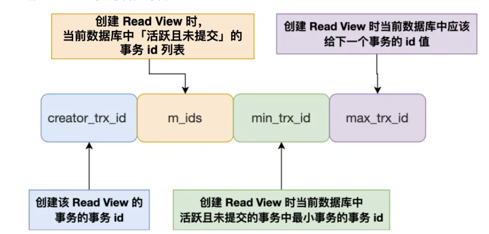
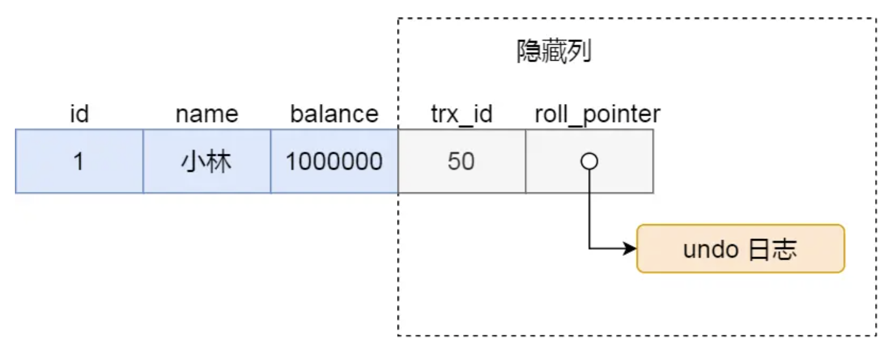

参考文档：https://www.xiaolincoding.com/mysql/transaction/mvcc.html#%E4%BA%8B%E5%8A%A1%E6%9C%89%E5%93%AA%E4%BA%9B%E7%89%B9%E6%80%A7
# 事务四个特性是什么，如何实现的
    MySQL的事务分为ACID
- A（Atomicity）：原子性；事务要么成功，要么失败。unlog回滚日志来实现的；
- C（Consistency）：一致性；其他三个特性合成的；
- I（Isolation）：隔离性；多个事务之间并行，事务之间不相互影响；MVCC（多版本并发控制）
- D（Durability）：持久性；事务的修改是永久的，即使故障也能恢复；redolog
# 事务隔离级别，脏读，幻读，可重复读都是什么，如何解决的？
- 脏读：  
    读到另一个事务未提交的数据
- 不可重复读：  
    一个事务多次读一个数据，结果不一致；
- 幻读：  
    同一个事务中，多次查询的结果集不一样；
- 事务隔离级别：
    - 读未提交（read uncommitted），指一个事务还没提交时，它做的变更就能被其他事务看到；
    - 读提交（read committed），指一个事务提交之后，它做的变更才能被其他事务看到；
    - 可重复读（repeatable read），指一个事务执行过程中看到的数据，一直跟这个事务启动时看到的数据是一致的，MySQL InnoDB 引擎的默认隔离级别；
    - 串行化（serializable ）；会对记录加上读写锁，在多个事务对这条记录进行读写操作时，如果发生了读写冲突的时候，后访问的事务必须等前一个事务执行完成，才能继续执行；
# MVCC具体如何工作？
- ReadView的关键事务id：
    
    - m_ids ：指的是在创建 Read View 时，当前数据库中「活跃事务」的事务 id 列表，注意是一个列表，“活跃事务”指的就是，启动了但还没提交的事务。
    - min_trx_id ：指的是在创建 Read View 时，当前数据库中「活跃事务」中事务 id 最小的事务，也就是 m_ids 的最小值。
    - max_trx_id ：这个并不是 m_ids 的最大值，而是创建 Read View 时当前数据库中应该给下一个事务的 id 值，也就是全局事务中最大的事务 id 值 + 1；
    - creator_trx_id ：指的是创建该 Read View 的事务的事务 id。
    
- 那具体事务的修改信息是怎么存储的呢？记录的版本链：
    
- 具体工作原理，依赖版本链；
    其实核心的思路就是：
    - 每次读数据的时候创建一个ReadView视图；
    - 然后这个视图里面记录可以读到的事务id信息，事务的隔离级别主要是取决于这里的可见的事务id时怎么记录的
# 快照读和当前读的区别？
    - 快照读：普通select语句 select * from user_t；
    - 当前读：select * from user_t for update; 
# 快照读如何避免幻读？
    依赖MVCC机制就行
# 当前读如何避免幻读？
    间隙锁 next-key lock
# 幻读是否被完全解决？
    没有，快照读和当前读穿插进行就会出现幻读；
