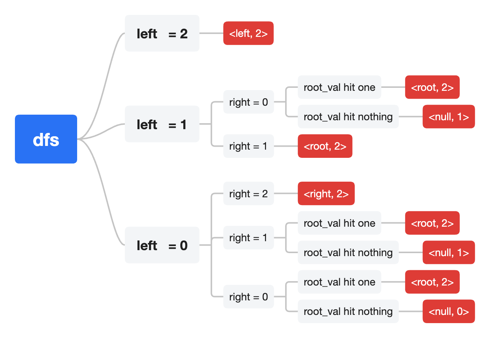

# 题目1: leetcode 236 给定一个二叉树, 找到该树中两个指定节点的最近公共祖先。
## 直觉问题
### 前提假设  
root的val各不相同，不会存在left和right都找到同一个数的情况
### 直觉分析
当时我想到了递归，但是我遇到了一个问题：  
我调用递归函数去find(root->left, val1, val2)，我怎么知道他是命中了一个还是2个呢？
- 所以分析结论应该是：  
<br></br>

其实如果按照这个思路也是能做出来的，就是有点复杂。
> 纠结点：当时的疑惑点是如果要返回多个结果，该如何返回。这里其实有很多解法：
- std::pair
- vector

这些我竟然都没有想到，所以说还是平时写的少了

### 直觉解法
```cpp
/**
 * Definition for a binary tree node.
 * struct TreeNode {
 *     int val;
 *     TreeNode *left;
 *     TreeNode *right;
 *     TreeNode(int x) : val(x), left(NULL), right(NULL) {}
 * };
 */
 // 第一反应写法
class Solution {
public:
    TreeNode* lowestCommonAncestor(TreeNode* root, TreeNode* p, TreeNode* q) {
        auto pair = find(root, p, q);
        if (pair.first == 2) {
            return pair.second;
        } else {
            return nullptr;
        }
    }
    std::pair<int, TreeNode*> find(TreeNode* root, TreeNode* p, TreeNode* q) {
        if (root == nullptr) {
            return std::make_pair(0, nullptr);
        }
        auto lres = find(root->left, p, q);
        if (lres.first == 2) return lres;
        auto rres = find(root->right, p, q);
        if (rres.first == 2) return rres;

        if (lres.first == 1 && rres.first == 1) {
            return std::make_pair(2, root);
        } else if (lres.first == 1 || rres.first == 1) {
            if (root == p || root == q) {
                return std::make_pair(2, root);
            } else {
                return std::make_pair(1, nullptr);
            }
        } else if (root == p || root == q) {
            return std::make_pair(1, nullptr);
        } else {
            return std::make_pair(0, nullptr);
        }
    }
};
```
### 优化思路一：这里可以用一个全局的数字来统计命中了多少个，然后直接返回可能的node就行
参考题目：力扣第 1644 题「二叉树的最近公共祖先 II」
```cpp
class Solution {
public:
    // 公共计数统计
    TreeNode* lowestCommonAncestor(TreeNode* root, TreeNode* p, TreeNode* q) {
        int hit = 0;
        auto* node = find(root, p, q, hit);
        return hit == 2 ? node : nullptr;
    }
    TreeNode* find(TreeNode* root, TreeNode* p, TreeNode* q, int& hit) {
        if (root == nullptr) {
            return nullptr;
        }
        
        auto* lfind = find(root->left, p, q, hit);
        auto* rfind = find(root->right, p, q, hit);
        if (root == p || root == q) {
            ++hit;
            return root;
        }
        if (lfind && rfind) {
            return root;
        }      
        return lfind ? lfind : rfind; 
    }
};
```

### 优化思路二：题目告诉你肯定有解，不用考虑hit数量
```cpp
class Solution {
public:
    // 公共计数统计
    TreeNode* lowestCommonAncestor(TreeNode* root, TreeNode* p, TreeNode* q) {
        if (root == nullptr || root == p || root == q) {
            return root;
        }
        
        auto* lfind = lowestCommonAncestor(root->left, p, q);
        auto* rfind = lowestCommonAncestor(root->right, p, q);
        if (lfind && rfind) {
            return root;
        }
        return lfind ? lfind : rfind; 
    }
};
```
### 题目变化：1676 题「二叉树的最近公共祖先 IV」：输入一个包含若干节点的列表nodes
参考优化思路一解法：
```cpp
class Solution {
public:
    // 题目变化，输入多个node
    TreeNode* lowestCommonAncestor(TreeNode* root, TreeNode* p, TreeNode* q) {
        std::set<TreeNode*> set;
        set.insert(p);
        set.insert(q);
        int hit = 0;
        auto* node = find(root, set, hit);
        return hit == set.size() ? node : nullptr;
    }
    TreeNode* find(TreeNode* root, std::set<TreeNode*>& set, int& hit) {
        if (root == nullptr) {
            return nullptr;
        }
        auto* lfind = find(root->left, set, hit);
        auto* rfind = find(root->right, set, hit);
        if (set.count(root) > 0) {
            ++hit;
            return root;
        }
        if (lfind && rfind) {
            return root;
        }      
        return lfind ? lfind : rfind; 
    }
};
```
### 题目变化2: 235. 二叉搜索树的最近公共祖先
```cpp
class Solution {
public:
    TreeNode* lowestCommonAncestor(TreeNode* root, TreeNode* p, TreeNode* q) {
        if (root == nullptr || root == p || root == q) {
            return root;
        }
        if (root->val < p->val && root->val < q->val) {
            return lowestCommonAncestor(root->right, p, q);
        }
        if (root->val > p->val && root->val > q->val) {
            return lowestCommonAncestor(root->left, p, q);
        }
        return root;
    }
};
```
### 题目变化3：力扣第 1650 题「二叉树的最近公共祖先 III」，这次输入的二叉树节点比较特殊，包含指向父节点的指针：
这个题解就是从子节点查找跟节点，两个链表的相交点，参考力扣第 160. 相交链表
```cpp
#include <iostream>
using namespace std;

struct TreeNode {
  int val;
  TreeNode* left;
  TreeNode* right;
  TreeNode* parent;
  TreeNode(int x) : val(x), left(nullptr), right(nullptr),parent(nullptr) {}
  void SetLink(TreeNode* l, TreeNode* r, TreeNode* p){
    left = l;
    right = r;
    parent = p;
  }
};

class Solution {
 public:
  int lowestCommonAncestor(TreeNode* headA, TreeNode* headB) {
    TreeNode* pa = headA;
    TreeNode* pb = headB;
    while(pa != pb) {
      pa = pa == nullptr ? headB : pa->parent;
      pb = pb == nullptr ? headA : pb->parent;
    }
    return pa == nullptr ? -1 : pa->val;
  }
};

int main() {
  Solution solu;
  TreeNode n6(6);
  TreeNode n5(5);
  TreeNode n4(4);
  TreeNode n3(3);
  TreeNode n2(2);
  TreeNode n1(1);
  n1.SetLink(&n2, &n3, nullptr);
  n2.SetLink(&n4, &n5, &n1);
  n3.SetLink(nullptr, nullptr, &n1);
  n4.SetLink(nullptr, nullptr, &n2);
  n5.SetLink(nullptr, &n6, &n2);
  n6.SetLink(nullptr, nullptr, &n5);
  std::cout << solu.lowestCommonAncestor(&n4, &n6) << std::endl;
  return 0;
}
```

