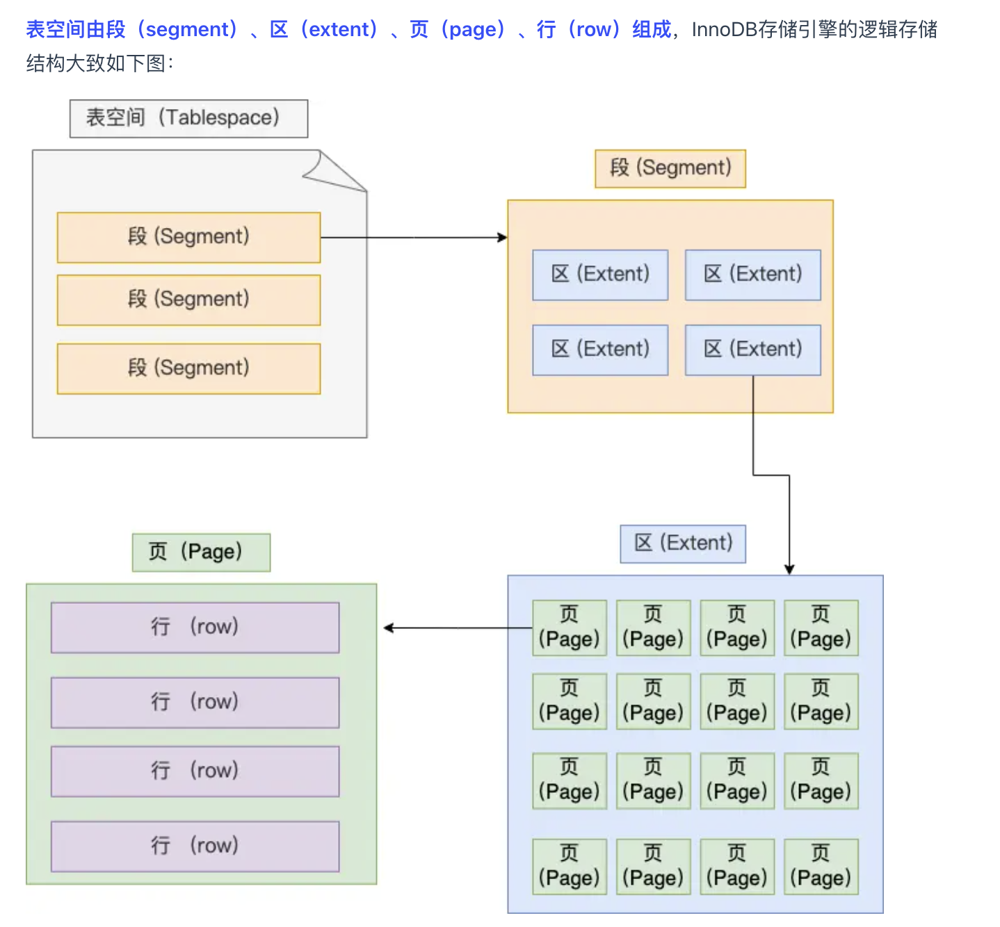

# MySQL 存储引擎
- MyISAM：不支持事务，表级别锁，非聚簇索引，不支持外键；读多场景
- InnoDB：支持事务，行锁，聚簇索引，支持外键；
- Memory：完全基于内存，数据易丢失

# InnoDB数据存储结构：

- 表：table
- 段：数据的逻辑区分，比如数据段，索引段；
- 区：64个页为一个区，方便顺序存储
- 页：16KB
- 行：一条记录

# 行存储结构(Compact)

- 变长字段列表：变成字段的长度记录，逆序；
- NULL值列表：可以为NULL的列的bitmap，逆序（临近原则，方便cache）；
- 记录头信息：一些记录重要的标志位；
- 隐藏列：MVCC事务控制使用；
- 行溢出了怎么处理？
    维护一个指向剩余地址的指针（Compact） 

# 页的存储结构

- User Records 记录信息；
- Page Directory：槽信息，方便二分检索；

# 参考文档
- [浅谈Mysql数据存储](https://juejin.cn/post/6844903970989670414)
- [MySQL 一行记录是怎么存储的？](https://www.xiaolincoding.com/mysql/base/row_format.html)
