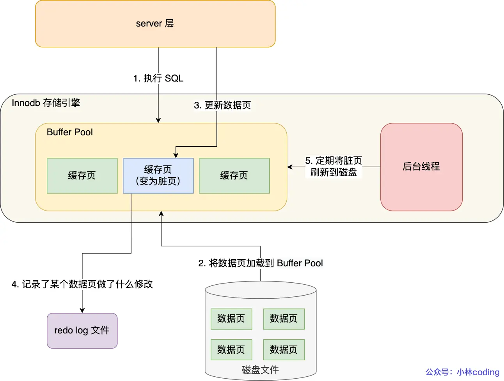

参考文档：https://www.xiaolincoding.com/mysql/log/how_update.html
# MySQL的日志
- undolog  
    是Innodb存储引擎层生成的日志，实现了事务中的原子性，主要用于事务回滚和 MVCC。
- redo log  
    是Innodb存储引擎层生成的日志，实现了事务中的持久性，主要用于掉电等故障恢复；
- binlog  
    是Server层生成的日志，主要用于数据备份和主从复制；
# undo log
## undo log版本链
- 实现事务回滚，保障事务的原子性
- MVCC控制，通过ReadView+unlog来实现事务的隔离属性
## undolog怎么刷盘
undo log和数据页的刷盘策略是一样的，都需要通过 redo log 保证持久化。  
buffer pool中有undo页，对 undo 页的修改也都会记录到 redo log。redo log 会每秒刷盘，提交事务时也会刷盘，数据页和 undo 页都是靠这个机制保证持久化的。
# redo log
## WAL技术：Write-Ahead Logging
更新数据的时候先更新内存，然后将页标记为脏页。合适时机，后台异步线程将数据更新刷盘
 

## redo log日志
redo log 是物理日志，记录了某个数据页做了什么修改，比如对 XXX 表空间中的 YYY 数据页 ZZZ 偏移量的地方做了AAA 更新，每当执行一个事务就会产生这样的一条或者多条物理日志。
- 数据的修改记录，在数据重启后能进行恢复 crash-safe能力；
- 将写操作从「随机写」变成了「顺序写」
## redo log刷盘
每当产生一条 redo log 时，会先写入到 redo log buffer，后续在持久化到磁盘如下图：

 

redo log buffer 默认大小 16 MB，可以通过 innodb_log_Buffer_size 参数动态的调整大小。增大它的大小可以让 MySQL 处理「大事务」是不必写入磁盘，进而提升写 IO 性能。
### 什么时机刷盘
redolog的刷盘分为三步，写redolog-buffer，PageCache，磁盘；因此对应3中策略；
- MySQL 正常关闭时；
- 当 redo log buffer 中记录的写入量大于 redo log buffer 内存空间的一半时，会触发落盘；
- InnoDB 的后台线程每隔 1 秒，将 redo log buffer 持久化到磁盘。
- 每次事务提交时都将缓存在 redo log buffer 里的 redo log 直接持久化到磁盘（这个策略可由 innodb_flush_log_at_trx_commit 参数控制）。
    innodb_flush_log_at_trx_commit = 0，1，2分别对应一下情况
     
### Redolog写满了怎么办：
redolog是一个环形的缓冲区，底层对应2个数据文件，当写满后，就回触发buffer的脏页写入到磁盘，然后刷新redolog-buffer；
因为redolog其实为了脏页存储而存在的，所以是固定大小的。

# binlog
## biglog与redolog的区别
- 使用对象不同：biglog主从同步使用的，Server写的日志；redolog：crash-safe恢复用的，存储引擎写的日志；
- 文件格式不同：binlog有3种模式：STATEMENT（默认格式）、ROW、 MIXED；redolog只有一中；
- 写入方式不同：binlog是追加写，redolog是循环写；

## 主从同步怎么实现
   
复制模型分为：同步复制，异步复制，半同步复制，主要区别就是是否等待从节点写完才返回成功

## binlog如何刷盘
>一个事务的 binlog 是不能被拆开的，否则如果中间出问题，则从库的数据可能是不完整的

# 两阶段提交
## 为什么需要两阶段提交
事务提交后，redo log 和 binlog都要持久化到磁盘，但是这两个是独立的逻辑，可能出现半成功的状态，这样就造成两份日志之间的逻辑不一致。
## 怎么实现
两阶段提交把单个事务的提交拆分成了 2 个阶段，分别是「准备（Prepare）阶段」和「提交（Commit）
 

## 两阶段有什么问题
- 磁盘 I/O 次数高：每次写都刷盘的话磁盘io很高
- 多事务下，两阶段必须要保证事务提交的顺序性：事务不一致可能导致数据不一致问题  
解决：组提交

 

