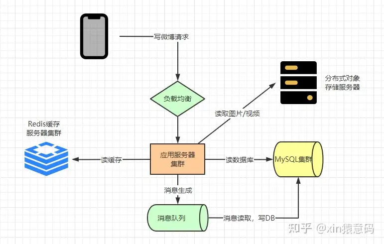

# 系统功能-业务建模

# DB设计
- 用户表(userinfo, user_id（pri_key, age, other……)
- 关注表(relation, id(主键), followed(被关注人, 外键, user_id), follower(关注人, 外键, user_id))
- 发帖表(post, id(主键), user_id(外键), postinfo)

# 系统架构
## 系统模块图

- cos：图片/视频存储服务
- 写DB：这里写DB用了消息队列，感觉直接写应该也可以
## 高性能，高并发
- 分库分表  
    使用use_id来进行分库拆分，提高系统并发度；同一个用户的读写操作尽量在同一个分片中；
- 关注表问题，冗余  
    关注表(relation)，如果查询关注了哪些人则在同一个分片中，如果查询粉丝list，则需要跨分区查看。这里可以将关注表进行冗余  
    所以我们将 relation 表拆分为：
    - follow 表：主键id，userId，followId
    - attention 表：主键id，userId，attentionId
- 访问热点问题，redis缓存，本地缓存
    - redis缓存
    缓存如粉丝表list，帖子list等关键信息，减轻读压力
    - 本地缓存
    特别大事件时，读事件突增。增加本地缓存来解决；
## 缓存的更新与一致性
    博主发送了一个帖子后，如何更新redis中的发帖表list
- 推送模式
    遍历粉丝表，将帖子id更新到所有粉丝的发帖表list中。针对大v，更新的量级多大，即写扩散问题
- 拉取模式
    只更新博主自己的帖子表，粉丝请求微博信息的时候，遍历博主list，同时去查。如果关注表的量级太大，读取压力过大。即读扩散问题
- 推拉结合模式
    区分大V，大V采用拉取模式，小V采取推送模式

# 参考文档 
[微博系统架构](https://zhuanlan.zhihu.com/p/610915804)