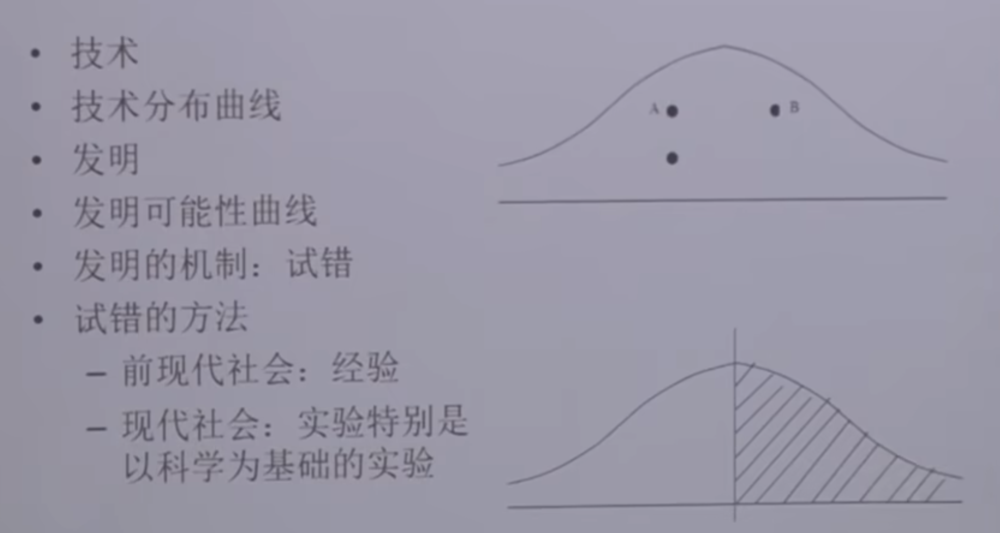

# 文档：
- B站视频：https://www.bilibili.com/video/BV1kB4y1H7R4?spm_id_from=333.788.videopod.episodes&vd_source=9bbaae8bc6b983e622d9599373de32ad&p=2

# 2.李约瑟之谜：为什么中国古代科学技术领先，当今又落后了
    理论核心点：既要介绍之前为什么领先，也要解释为什么现在落后
- 文化决定论：不能解释为什么古代为什么强盛？
- 国家竞争论：竞争有优势，同样无法解释古代强盛？
- 高水平均衡理论：
- 林毅夫假说：技术提升方式改变
    - 古代：经验，偶然发现技术，人多力量大
    - 现代：科学指导下发明技术
## 发明就是试错的过程
- 技术就是各种要素的组合进行生产的知识
    - 发明可能性曲线：
        - 横坐标：生产的价值总和；纵坐标：技术的总量
        - A，B，C点分别代表技术，比当前生产价值高的技术都叫做发明
        
    - 实验方式来进行发明
    - 科学方式指导发明
- 为什么科学革命没有再中国发生？
    - 科举制度，聪明人都去做官了

# 3. 
