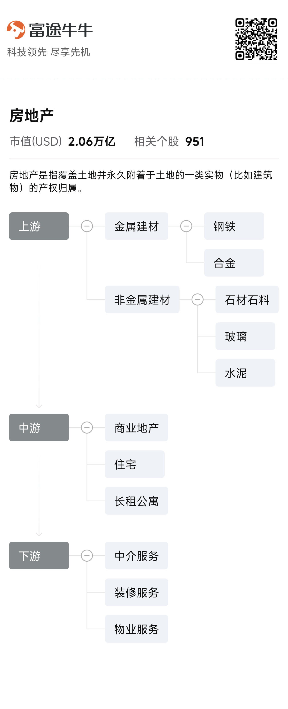

- 观察了日本和美国的房地产崩溃之后的修复情况，感觉房地产迟早会反弹，只是不确定具体时间而已。
- 股市的低点一般会领先房地产低点3-5年左右，观察港股2024年基本已经达到低点，而且当前已经恢复到之前最高点的26975/33484 = 80%，感觉房价基本上也会回来的，只不过是时间的问题
- 通过以上分析得出：房地产目前处于最低点了，后续肯定会反弹回来。只不过是时间的问题。所以这里想看下中国的比较优质的房地产企业，看那些可以值得投资的。

看了一个图，挺有意思：
  
这里主要讨论中游，地产/住宅部分。列出一下头部的企业：

- 华润置地​​ (1109.HK)
- ​万科A​​ (000002.SZ)

对比一下，最终觉得这两家不错。可以进行长期投资

